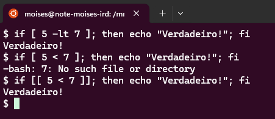

# Condicionais do Bash

## Visão Geral do if

```bash
numero=0

if [ "$numero" -gt 0 ]
then
  echo "O número é positivo."
elif [ "$numero" -lt 0 ]
then
  echo "O número é negativo."
else
  echo "O número é zero."
fi
```

### A necessidade do `then`

No Bash e em outras shells compatíveis, a palavra-chave then é parte integrante da sintaxe do comando if. Ela é usada para definir claramente onde começam os comandos que serão executados se a condição testada pelo if for verdadeira. Aqui estão alguns pontos importantes sobre o uso de then e por que ele é necessário:

**Delimitação de Blocos**: O then serve para delimitar o início do bloco de comandos que deve ser executado se a condição especificada no if for avaliada como verdadeira. Sem o then, o shell não teria como saber onde começa esse bloco de comandos.

**Clareza e Legibilidade**: Usar then torna o script mais legível e claro. Ele separa claramente a condição de teste dos comandos a serem executados, facilitando a leitura e a manutenção do código.

**Sintaxe Formal**: A sintaxe do if em Bash e shells POSIX exige o uso de then. Isso ajuda a evitar ambiguidades no script, especialmente em scripts mais complexos com múltiplas condições e aninhamentos.

### Diferença entre `[ ... ]` e `[[ ... ]]`

No shell scripting, especialmente no contexto do Bash, a diferença entre usar um par de colchetes [ ... ] e dois pares de colchetes [[ ... ]] para cercar uma expressão é significativa e impacta como as expressões são avaliadas e quais funcionalidades estão disponíveis. Ambos são usados para testar condições, mas existem diferenças chave:

#### 1. [ ... ] (Teste Condicional POSIX)
Portabilidade: O comando [ ... ] é compatível com a especificação POSIX, o que significa que scripts que o utilizam serão portáveis e deverão funcionar em qualquer shell que siga o padrão POSIX, como sh, Bash, e Dash.
Comportamento: Dentro de [ ... ], os operadores e as strings são interpretados pelo shell antes do teste condicional ser processado. Por exemplo, você deve usar "$variavel" para garantir que valores em branco sejam corretamente manipulados.
Operadores: Suporta operadores de teste básicos como -eq, -ne, -lt, -le, -gt, -ge, para comparações numéricas, e =, !=, para comparações de string.
Limitações: Não suporta certas operações mais complexas, como regex diretamente ou operadores lógicos avançados (&&, ||) dentro da expressão. Operadores lógicos devem ser manipulados fora dos colchetes: [ $a -lt $b ] && [ $c -eq $d ].

#### 2. [[ ... ]] (Construção Avançada do Bash)
Não-portabilidade: [[ ... ]] é uma funcionalidade avançada do Bash e de alguns outros shells modernos, mas não é compatível com todos os ambientes POSIX. Scripts que utilizam [[ ... ]] podem não funcionar em shells que não sejam Bash.
Comportamento Avançado: As expressões dentro de [[ ... ]] são tratadas de maneira especial pelo Bash, o que permite o uso de recursos adicionais como regex e padrões glob sem a necessidade de aspas extras, mesmo para strings que contêm espaços.
Operadores: Suporta operadores lógicos avançados diretamente dentro dos colchetes, como && e || para combinações lógicas, bem como == e != para comparações de padrão (globbing).
Manipulação de Strings e Regex: Dentro de [[ ... ]], você pode fazer comparações de padrões usando globbing (ex: [[ $a == z* ]]) para verificar se uma variável corresponde a um padrão. Também suporta expressões regulares diretamente com =~.

### Exemplos Práticos

```bash
# Uso de [ ... ]
if [ "$a" -lt "$b" ] && [ "$c" -eq "$d" ]; then
  echo "Ambas as condições são verdadeiras."
fi

# Uso de [[ ... ]]
if [[ $a < $b && $c == $d ]]; then
  echo "Ambas as condições são verdadeiras com [[ ... ]]."
fi

# Regex com [[ ... ]]
if [[ $texto =~ ^[0-9]+$ ]]; then
  echo "O texto é um número."
fi
```

#### Demonstração 

Veja na imagem abaixo que o operador `<` não é reconhecido quando usamos `[ ... ]`, mas é quando usamos `[[ ... ]]`



### Operadores de Comparação Numérica

```bash
# Operador de igualdade
if [ "$a" -eq "$b" ]; then
  echo "a é igual a b."
fi

# Operador de desigualdade
if [ "$a" -ne "$b" ]; then
  echo "a não é igual a b."
fi

# Operador maior que
if [ "$a" -gt "$b" ]; then
  echo "a é maior que b."
fi

# Operador maior ou igual a
if [ "$a" -ge "$b" ]; then
  echo "a é maior ou igual a b."
fi

# Operador menor que
if [ "$a" -lt "$b" ]; then
  echo "a é menor que b."
fi

# Operador menor ou igual a
if [ "$a" -le "$b" ]; then
  echo "a é menor ou igual a b."
fi
```

[Voltar para Visão Geral](../README.md)