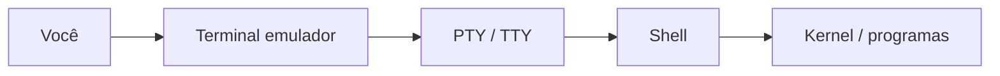
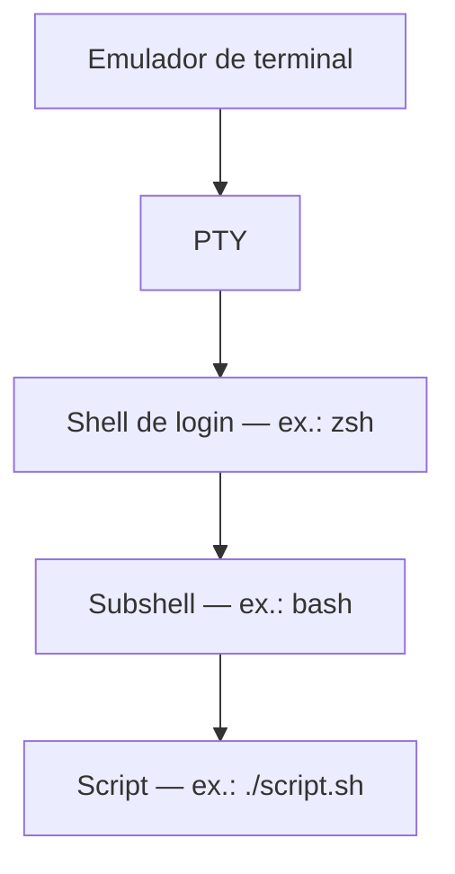

# 🐚 Shell: TTY, PTY e sessões

Aprofundamento do tópico [O que é um shell?](../../iniciante/shell/shell.md). Aqui: canal de texto entre terminal e shell, empilhamento de processos e ambientes Bash no Windows e macOS.

## 🖥️ TTY e PTY

**TTY** vem de *teletypewriter* (teletipo). No Linux/Unix continua sendo a **interface de entrada e saída em texto** entre você e o sistema — o “fio” pelo qual caracteres vão e voltam.

| Papel | Quem |
|-------|------|
| 🖥️ **Terminal** | Aplicativo (janela, abas, fontes) |
| 🖥️ **TTY / PTY** | Canal de comunicação em modo texto |
| 🖥️ **Shell** | Programa que interpreta comandos |

```text
Você → Terminal → PTY/TTY → Shell → Sistema operacional
```

### 🔹 O que é TTY hoje?

**TTY** designa esse canal: teclas viram bytes para o shell; `stdout`/`stderr` voltam como texto para quem está do outro lado (emulador, SSH, console).

### 🔹 Tipos de TTY

#### 1. TTY físico (histórico)

Teletipos ligados ao computador; o kernel tratava cada aparelho como dispositivo de terminal. O vocabulário (`tty`, `/dev`) permaneceu.

#### 2. TTY virtual (console Linux)

**Ctrl+Alt+F1**–**F6** (em muitas distros) abre **consoles em modo texto** sem interface gráfica — `tty1`, `tty2`… Útil para recuperação quando o ambiente gráfico falha.

#### 3. PTY (pseudo-TTY) — o mais comum

Ao abrir **GNOME Terminal**, **Windows Terminal**, terminal do **VS Code** ou **SSH** interativo:

- 📌 Não há teletipo físico.
- 🖥️ O sistema cria um **PTY** (*pseudo-terminal*): par mestre/escravo que **simula** um TTY.
- 🖥️ O **emulador** usa um lado; o **shell** (filho) usa o outro.

Por isso `tty` em janela gráfica costuma mostrar `/dev/pts/0`, `/dev/pts/1` (**pts** = *pseudo-terminal slave*).

### 🔹 Como ver seu TTY atual

```bash
tty
```

Exemplos:

```text
/dev/pts/0    # pseudo-terminal — terminal gráfico, SSH, VS Code
/dev/tty2     # console virtual (Ctrl+Alt+F2)
```

```bash
who am i          # usuário, TTY e horário (quando disponível)
w                 # quem está logado e em qual TTY
```

### 🔹 Relação com terminal e shell



- 🖥️ Fechar o **terminal** encerra o **PTY** → o **shell** perde o canal e em geral termina (**SIGHUP**).
- 🖥️ Trocar de shell (`bash`, `zsh`) no mesmo terminal: o **PTY** costuma ser o mesmo; muda o processo interpretador.
- 🖥️ `bash script.sh`: pode usar o mesmo PTY da sessão; o terminal só exibe saída.

### 🔹 Exemplos com TTY

```bash
echo $SHELL              # shell de login configurado
ps -p $$ -o comm=        # nome do processo do shell desta sessão
tty                      # ex.: /dev/pts/0
```

A saída de `tty` indica qual **canal** esta sessão usa — sessões em abas diferentes têm `pts` diferentes.

Ao executar `bash script.sh`, quem interpreta é um processo **Bash** filho; o terminal mostra `stdout`/`stderr`. O mesmo script pode rodar em GNOME Terminal, SSH ou CI: importa o **interpretador do shebang**, não a janela gráfica.

## 🖥️ Shell dentro de shell (empilhamento)

Cada invocação cria um processo filho com ambiente próprio (variáveis, diretório, histórico).

```text
[terminal] → zsh (login) → bash (subshell) → exit → volta ao zsh
```

Casos frequentes:

- ⌨️ `bash script.sh` — script em Bash mesmo com prompt Zsh.
- 📖 `sh script.sh` — pode usar **dash** ou Bash em modo POSIX, conforme o sistema.
- 🖥️ SSH: shell remoto; dentro dele, outro shell ou `tmux`.
- 🖥️ CI/contêineres: job em `/bin/bash` independente do shell padrão do runner.

Mudanças **dentro** do shell interno (`cd`, `export`) em geral **não** alteram o pai — `exit` restaura o nível anterior.



## 📖 Histórico: Bourne, Bash e Zsh

| Shell | Papel |
|-------|--------|
| **`sh` (Bourne)** | Base POSIX/Bourne; em Linux `/bin/sh` costuma ser **dash** ou Bash compatível |
| **Bash** | Extensões: arrays, `[[ ]]`, `source`, histórico; padrão em servidores e CI |
| **Zsh** | Bourne-like + autocompletar/globbing; padrão no macOS (Catalina+) |

**Fish** e **PowerShell** ficam fora da linha Bourne/POSIX — ver tabela no [nível iniciante](../../iniciante/shell/shell.md).

### 🔹 Compatibilidade na prática

- 🔀 **`#!/bin/bash` vs `#!/bin/sh`**: o segundo limita-se ao POSIX; teste em ambos se precisar portar.
- 🖥️ **Zsh como interpretador**: `zsh script.zsh` segue regras do Zsh; material Bash: `bash script.sh`.
- 🖥️ **PowerShell**: outro modelo (objetos, cmdlets); use Bash-like (Git Bash, WSL) para exemplos `.sh` deste repositório.

## 📖 Bash no Windows

| Opção | O que é | Vantagens | Limitações |
|-------|---------|-----------|------------|
| **Git Bash** | Bash + utilitários Unix mínimos (Git for Windows) | Leve, scripts `.sh` simples | Não é Linux completo; paths `C:\...`; sem `apt` |
| **WSL (WSL2)** | Linux real no Windows | Ubuntu, `apt`, comportamento de servidor | Mais recurso; `/mnt/c` com nuances de permissão |
| **PowerShell** | Shell nativo Windows | .NET, AD, Azure | Sintaxe diferente; scripts do repo não rodam sem reescrever |

Recomendação: **Git Bash** para exercícios rápidos; **WSL** para pacotes (`bc`, `tmux`) e paridade com Linux.

## 📖 Bash no macOS

- 🖥️ **Terminal** / iTerm2 abrem **Zsh** por padrão; para estudar Bash: `bash` no prompt ou `bash arquivo.sh`.
- 📖 Shebang `#!/bin/bash` usa o Bash do `PATH`; confira `which bash` e `bash --version`.
- 📖 Bash do sistema pode ser antigo; para alinhar com Linux: **Homebrew** (`brew install bash`) e `#!/usr/bin/env bash`.

No macOS, instalar iTerm2 só troca o **emulador**; o shell padrão continua Zsh até você mudar ou invocar Bash explicitamente.

## 📝 Resumo

1. 🖥️ **TTY** = canal de texto; no dia a dia quase tudo passa por **PTY** (`/dev/pts/N`).
2. 🖥️ Fechar o terminal → SIGHUP no shell; empilhar shells isola `cd`/`export` por nível.
3. 📖 Teste scripts com o interpretador do shebang; Windows: Git Bash ou WSL; Mac: invoque Bash explicitamente.

## ➡️ Próximo passo

[trap](../trap/trap.md) — sinais, `SIGINT`, `EXIT` e limpeza de recursos (ligado a SIGHUP ao encerrar sessões).
