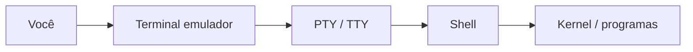
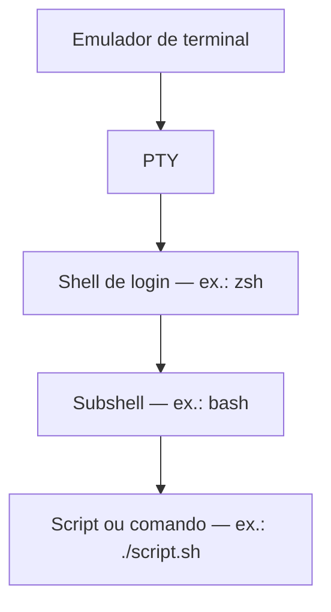

# O que é um shell?

Um **shell** é o programa que lê o que você digita, interpreta comandos, inicia outros programas e devolve a saída para você. Ele fica entre o **usuário** e o **sistema operacional** (na prática, entre você e o kernel): você não fala diretamente com o kernel; o shell traduz suas instruções em processos, arquivos abertos, pipes e sinais.

## Terminal vs shell

São camadas diferentes. Confundi-las é comum porque, no dia a dia, abrimos “o terminal” e já aparece um prompt — mas o que **executa** `ls` ou um script `.sh` é o **shell**, não a janela.

| | **Terminal (emulador)** | **Shell** |
|---|-------------------------|-----------|
| **O que é** | Aplicação gráfica (ou interface) que mostra texto e envia o que você digita para um programa | Programa que interpreta comandos e scripts |
| **Exemplos** | GNOME Terminal, Konsole, iTerm2, Windows Terminal, Terminal.app (macOS), Guake | Bash, Zsh, `sh`, Fish, PowerShell |
| **Responsabilidade** | Fonte, cores, abas, scroll, copiar/colar, tamanho da janela | Prompt, variáveis, `cd`, pipes, loops, `if`, histórico de comandos |
| **Troca** | Abrir outro terminal não muda a linguagem do shell por si só | `bash`, `zsh` ou mudar o shell padrão altera o interpretador |

Analogia rápida: o **terminal** é o “monitor + teclado” na mesa; o **shell** é o “tradutor” que entende o que você pediu e fala com o sistema operacional.

```text
Você → [ Terminal: janela ] → [ TTY/PTY: canal de texto ] → [ Shell: bash/zsh ] → [ Comandos ] → SO
```

Entre o emulador e o shell existe um **canal de texto** (TTY ou PTY). O terminal não executa `grep`; ele desenha caracteres e repassa teclas por esse canal. Detalhes em [TTY e PTY](#tty-e-pty) abaixo.

### Exemplos didáticos

**1. Mesmo shell, terminais diferentes**

Você pode abrir **dois** GNOME Terminals (ou uma aba no iTerm2 e outra no Windows Terminal) e em ambos rodar Bash. Os prompts parecem iguais, mas são **sessões separadas**: um `cd /tmp` em uma janela não muda o diretório na outra.

```bash
# Janela A
pwd    # /home/alice
cd /tmp

# Janela B (outro terminal, mesmo usuário, mesmo bash)
pwd    # ainda /home/alice — outro processo shell
```

**2. Mesmo terminal, shells diferentes**

No **mesmo** emulador você pode trocar só o interpretador. O terminal continua o mesmo; o programa que entende os comandos muda.

```bash
echo $SHELL          # ex.: /usr/bin/zsh  (shell de login)
bash                 # agora o interpretador ativo é Bash
echo $0              # bash (ou -bash)
exit                 # volta ao zsh; o terminal nem fechou
```

**3. O terminal não entende Bash — o shell entende**

Se você digitar `for i in 1 2 3` no prompt do Bash, o **Bash** faz o loop. Se abrir o PowerShell no Windows Terminal e colar o mesmo trecho, vai falhar: o **terminal** só repassou o texto; quem interpretou foi outro shell.

```bash
# Funciona no Bash/Zsh (estilo Bourne)
for i in 1 2 3; do echo $i; done
```

No PowerShell a sintaxe é outra (`foreach`); o Windows Terminal não “converte” automaticamente.

**4. Descobrir o que está rodando**

```bash
echo $SHELL              # shell de login configurado para o usuário
ps -p $$ -o comm=        # nome do processo do shell *desta* sessão
tty                      # dispositivo TTY desta sessão (ex.: /dev/pts/0)
```

A saída de `tty` indica qual **canal** esta sessão usa; veja a seção [TTY e PTY](#tty-e-pty).

No macOS, abrir o app **Terminal** inicia o **Zsh** por padrão — o app é o emulador; o Zsh é o shell. Instalar iTerm2 só troca o emulador; para estudar Bash você ainda roda `bash` ou altera o shell padrão.

**5. Script e terminal**

Ao executar `bash script.sh`, quem interpreta o arquivo é o processo **Bash** filho. O terminal apenas mostra `stdout` e `stderr`. Por isso o mesmo script pode rodar em GNOME Terminal, SSH ou CI: o que importa é ter **Bash** (ou o interpretador do shebang), não qual janela gráfica você usou.

### Erros comuns

- **“Meu terminal é Bash”** — em geral o terminal é *Windows Terminal* / *GNOME Terminal*; o shell padrão é que pode ser Bash.
- **Fechar o terminal mata o shell** — sim: o emulador encerra a sessão PTY e o processo do shell recebe SIGHUP. Jobs em background podem morrer junto (a menos que use `nohup`, `disown` ou `tmux`).
- **Trocar tema/cor no terminal** — não afeta scripts; trocar de `bash` para `zsh` pode afetar sintaxe e autocompletar.

## TTY e PTY

**TTY** vem de *teletypewriter* (teletipo). O nome é antigo, mas o conceito continua central no Linux e no Unix: é a **interface de entrada e saída em texto** entre você e o sistema — o “fio” pelo qual caracteres vão e voltam, independentemente de haver ou não uma janela gráfica.

| Papel | Quem |
|-------|------|
| **Terminal** | Aplicativo (janela, abas, fontes) |
| **TTY / PTY** | Canal de comunicação em modo texto |
| **Shell** | Programa que interpreta comandos |

```text
Você → Terminal → PTY/TTY → Shell → Sistema operacional
```

### O que é TTY hoje?

No uso moderno, **TTY** designa esse canal de texto: teclas que você digita viram bytes para o shell; saída do shell (`echo`, erros, programas) volta como texto para quem está “do outro lado” do canal (emulador, SSH, console).

### Tipos de TTY

#### 1. TTY físico (histórico)

Antes das interfaces gráficas, **teletipos** (máquinas de escrever ligadas ao computador) eram o meio de interação. O kernel tratava cada aparelho como um dispositivo de terminal. Hoje isso é curiosidade histórica, mas o vocabulário (`tty`, permissões em `/dev`) permaneceu.

#### 2. TTY virtual (console Linux)

No Linux, **Ctrl+Alt+F1** até **F6** (em muitas distros) abre **consoles em modo texto** sem ambiente gráfico — sessões diretas no sistema:

- `tty1`, `tty2`, `tty3`…
- Úteis para recuperação quando a interface gráfica falha; o shell (ex.: login em `tty1`) ainda é um programa; o “lugar” é um TTY virtual do kernel.

#### 3. PTY (pseudo-TTY) — o mais comum no dia a dia

Quando você abre **GNOME Terminal**, **Windows Terminal**, o terminal do **VS Code** ou uma sessão **SSH** interativa:

- Não há teletipo físico.
- O sistema cria um **PTY** (*pseudo-terminal*): um par mestre/escravo que **simula** um TTY real.
- O **emulador** fala com um lado do par; o **shell** (filho) usa o outro, como se estivesse num terminal dedicado.

Por isso `tty` em uma janela gráfica costuma mostrar `/dev/pts/0`, `/dev/pts/1`, etc. (**pts** = *pseudo-terminal slave*).

### Como ver seu TTY atual

```bash
tty
```

Exemplos de saída:

```text
/dev/pts/0    # pseudo-terminal — terminal gráfico, SSH, VS Code
/dev/tty2     # console virtual (modo texto, Ctrl+Alt+F2)
```

Outros comandos relacionados:

```bash
who am i          # usuário, TTY e horário (quando disponível)
w                 # quem está logado e em qual TTY
```

### Relação com terminal e shell (visão completa)



- Fechar o **terminal** encerra o **PTY** → o **shell** perde o canal e em geral termina (SIGHUP).
- Trocar de **shell** (`bash`, `zsh`) no mesmo terminal: o **PTY** costuma ser o mesmo; muda só o processo interpretador (ou um filho novo, se você rodou `bash` dentro do Zsh).
- Rodar script com `bash script.sh`: pode usar o mesmo PTY da sessão ou outro canal se a saída for redirecionada.

### Resumo TTY

- **TTY** = interface de texto com o sistema (histórico: teletipo; hoje: conceito de canal).
- Pode ser **console virtual** (`/dev/ttyN`) ou **simulado** (**PTY**, `/dev/pts/N`).
- No estudo de shell scripting, quase tudo que você usa no “terminal moderno” passa por **PTY**; o shell é quem interpreta; o emulador só exibe e envia bytes pelo canal.

## Shell dentro de shell (empilhamento)

Você pode **abrir um shell dentro de outro** — cada invocação cria um processo filho com seu próprio ambiente (variáveis, diretório atual, histórico). Isso é comum e útil para testar scripts sem sair da sessão atual.

Exemplo: seu shell de login é **Zsh**, e dentro dele você chama **Bash**:

```text
[terminal] → zsh (login) → você digita: bash → bash (subshell) → exit → volta ao zsh
```

Outros casos frequentes:

- `bash script.sh` — o script roda em um processo Bash, mesmo que o prompt seja Zsh.
- `sh script.sh` — pode usar `dash` ou `bash` em modo compatível com POSIX, dependendo do sistema.
- SSH remoto: `ssh servidor` abre um shell no host remoto; lá dentro você pode iniciar outro shell ou `tmux`.
- Contêineres e CI: o job entra em `/bin/bash` mesmo que o runner use outro shell por padrão.

Cada camada empilhada herda parte do ambiente (por exemplo `PATH`), mas mudanças feitas **dentro** do shell interno (`cd`, `export`) em geral **não** alteram o shell pai — ao dar `exit`, você volta ao nível anterior.



## Breve histórico: `sh`, Bash e Zsh

| Shell | Papel |
|-------|--------|
| **`sh` (Bourne shell)** | Shell clássico do Unix (anos 1970). Sintaxe enxuta, base do “estilo Bourne”. Em muitas distros Linux, `/bin/sh` hoje aponta para **dash** ou Bash em modo POSIX — não assuma que `sh` = Bash. |
| **Bash (Bourne Again Shell)** | Evolução do Bourne, padrão em servidores Linux, Git Bash, WSL e em muitos scripts de instalação. Extensões: arrays, `[[ ]]`, `$(())`, `source`, histórico avançado. |
| **Zsh** | Bourne-like com recursos extras (autocompletar rico, globbing poderoso). **Shell padrão no macOS** desde o Catalina; muito usado com Oh My Zsh. |

### Por que este repositório usa Bash?

Para material de estudo e scripts portáveis, o **Bash continua sendo a escolha mais compatível**: presente quase em todo Linux, em pipelines de CI, em imagens Docker, em documentação de servidores e em ferramentas que assumem `#!/bin/bash`. Scripts escritos para Bash rodam previsivelmente nesses ambientes.

O **Zsh** é excelente como shell **interativo** no dia a dia, mas scripts que usam só recursos POSIX costumam rodar em ambos; scripts com sintaxe **específica de Bash** (`[[`, arrays associativos, etc.) podem falhar se você executar com `sh` ou em Zsh sem Bash instalado. No macOS, a versão do Bash que vem com o sistema costuma ser antiga; para aprender com Bash 5+, instale via Homebrew (`brew install bash`) e invoque explicitamente `/opt/homebrew/bin/bash` ou `/usr/local/bin/bash`.

## Compatibilidade: Bash, Zsh, `sh` e PowerShell

- **`#!/bin/bash` vs `#!/bin/sh`**: o segundo pede compatibilidade POSIX; o primeiro permite recursos do Bash. Não misture sem testar.
- **Zsh como interpretador**: `zsh script.zsh` usa regras do Zsh; um `.sh` pensado para Bash deve ser rodado com `bash script.sh`, não assumindo que o shell padrão do usuário é Bash.
- **PowerShell** (`pwsh` / Windows PowerShell) é outro **shell e linguagem de script** (cmdlets, objetos .NET, sintaxe diferente). Não é substituto direto do Bash: pipelines, variáveis e operadores seguem outro modelo. No Windows, PowerShell é nativo e poderoso para administração Microsoft; para o conteúdo **deste repositório** (POSIX, `grep`, `awk`, redirecionamento clássico), use um ambiente **Bash-like**.

## Aprender Bash no Windows

| Opção | O que é | Vantagens | Limitações / tradeoffs |
|-------|---------|-----------|-------------------------|
| **Git Bash** | Bash + utilitários Unix mínimos, junto ao Git for Windows | Leve, bom para clonar repos e rodar scripts `.sh` simples | Não é Linux completo: paths `C:\...`, alguns comandos faltam ou diferem; `apt` e serviços Linux não existem aqui |
| **WSL (WSL2)** | Subsistema Linux real no Windows | Experiência próxima de um servidor Ubuntu; Bash, `apt`, paths Linux | Consome mais recurso; arquivos entre Windows (`/mnt/c`) e Linux têm nuances de permissão e performance |
| **PowerShell** | Shell nativo Windows | Integração com .NET, AD, Azure, WMI | Sintaxe e semântica diferentes do Bash; scripts deste repo não rodam sem reescrever |

Recomendação prática: use **Git Bash** para exercícios rápidos e **WSL** quando precisar de pacotes (`bc`, `tmux`, comportamento idêntico ao Linux).

## Aprender Bash no macOS

- O **Terminal** (ou iTerm2) abre por padrão o **Zsh**; isso não impede de estudar Bash: instale ou use o Bash do sistema e execute `bash` no prompt ou `bash arquivo.sh`.
- Scripts com shebang `#!/bin/bash` usam o Bash indicado no PATH; confira com `which bash` e `bash --version`.
- Para alinhar com Linux moderno, prefira Bash do **Homebrew** e scripts explícitos: `#!/usr/bin/env bash`.

## Resumo

1. **Terminal** = janela; **TTY/PTY** = canal de texto; **shell** = interpretador — três camadas distintas (hoje o dia a dia usa sobretudo **PTY**).
2. Você pode **empilhar shells** (`zsh` → `bash` → script); cada nível é um processo com `exit` para voltar.
3. **Bash** é o alvo didático e o mais **compatível** em servidores, CI e material legado POSIX/Bourne.
4. **Zsh** é ótimo no teclado; teste scripts de estudo com `bash`, não só com o shell padrão do Mac.
5. No **Windows**, Git Bash ou WSL; **PowerShell** é ferramenta complementar, não equivalente aos exemplos em `.sh` deste repositório.
